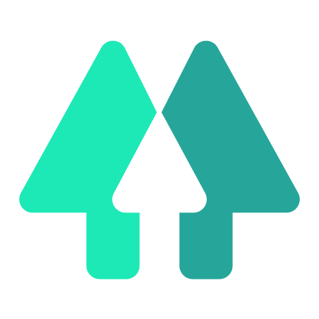

> Call me Tian Hao (Thomas) Wang!

  

  

  

  

I'm a software engineer from Melbourne. Pleased to meet you!

## About Me

My greatest passion in life is "making stuff", no matter what the "stuff" is.

- I'm a 🎶 musician (🎤🎸🎹) and composer!
- I'm a 🖋 writer and editor with a focus on 🎮 interactive media.
- I enjoy robotics, software prototyping, and startup side projects.

My favourite fruits are 🍎 Fuji apples, I love making ☕ coffee, and my favourite colour is 🌸 magenta.

## Skills

I was raised by...

  
  
  

...but day-to-day, I'm very comfortable with:

  
  
  
  
  

...and I'm happily learning:

  

More keywords!

- GCP, AWS, and cloud services/products at-scale.
- Full-stack and end-to-end product deployment.
- Algorithms and data structures.
- UX design and accessibility.

Non-technical keywords!

- Prototyping and design thinking.
- Presenter and tutor.
- Product management/technical leadership for small teams.

## Credits

- PFP drawn by [@FiveClawD](https://twitter.com/FiveClawD).
