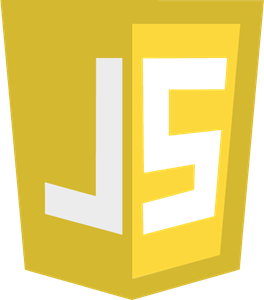
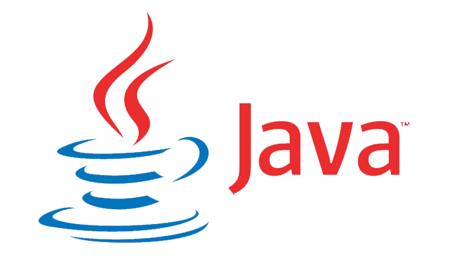
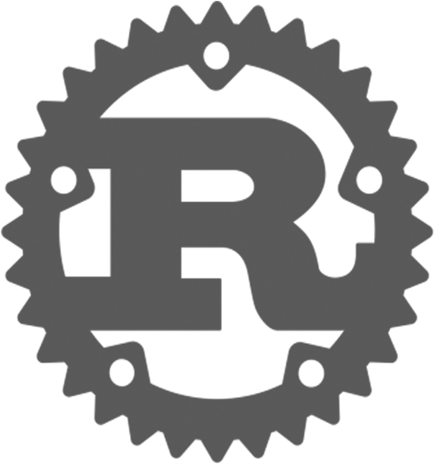
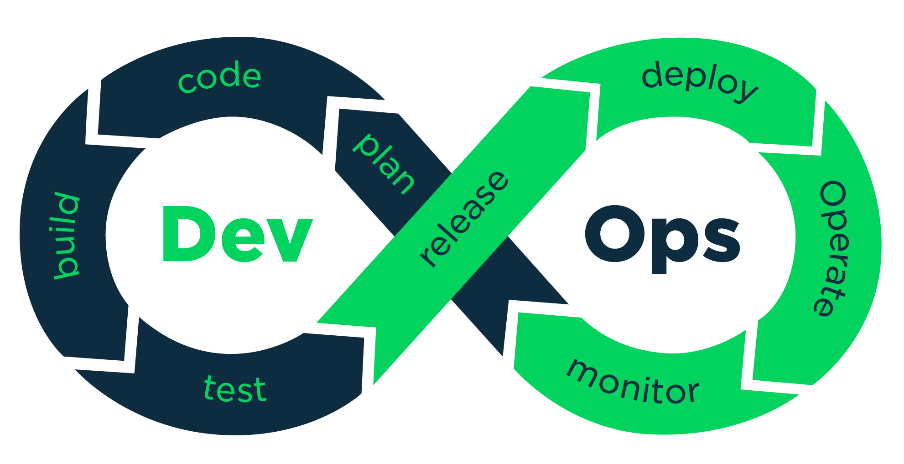
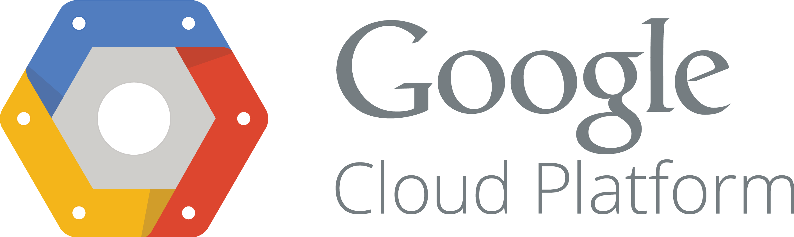

# G'day, Team

I'm Thomas, a software engineer from Melbourne.

You can see [my socials here](https://linktr.ee/paced)!

## Skills

When it comes to languages and frameworks:

- My most proficient tool is Python (3.8+).
  - Django, Flask, and so on.
- I was raised on C and Java and am very familiar with both.
- I'm currently learning Rust.
  - Loving it so far!
- I'm very comfortable with TypeScript (and JavaScript).

When it comes to other technical skills:

- I have always worked in some kind of DevOps or DevOps-adjacent role.
- I'm familiar with GCP, AWS, and cloud services/products at-scale.
- I have knowledge of full-stack and end-to-end product deployment.
- I'm very familiar with SQL and relational databases.
  - ...and opinionated on when to use/not use them.
- I've got a background in algorithms and data structures.
- I consider myself proficient with UX design and accessibility.

...and transverse skills:

- I enjoy and am familiar with prototyping/design thinking.
- I'm a presenter and love to give lectures on topics I'm passionate about!
- I've done some product management and performed technical leadership for small teams.
- I worked as a tutor for people new to tech for many years, on-and-off.

## About Me

My greatest passion in life is "making stuff", no matter what that "stuff" is.

- I'm a musician (vocalist, guitarist, pianist) and producer/composer!
- I'm a writer and editor with a focus on interactive media.
- I enjoy robotics, software prototyping, and startup side projects.

My favourite fruits are Fuji apples, I love making coffee, and my favourite colour is magenta.

## Credits

- PFP drawn by [@FiveClawD](https://twitter.com/FiveClawD).
